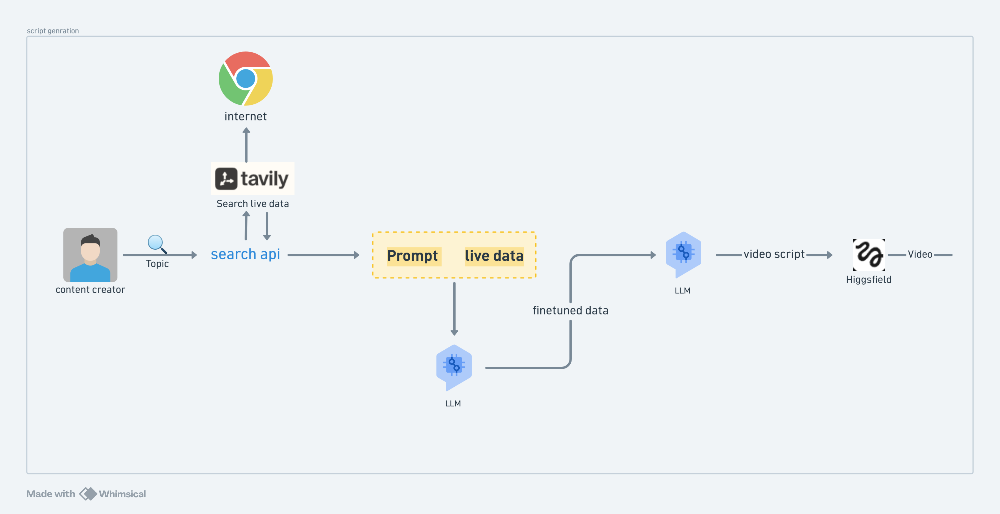

# 🎬 Real-Time YouTube Script Generator & MCP Server

🚀 **Live Demo**: [Real-Time YouTube Script Generator](https://real-time-youtube-script-generator-mcp-server-kv2sp2x863hpu8bh.streamlit.app/)


An AI-powered application that retrieves real-time web information using **Tavily Search** and converts it into high-retention, production-ready short video scripts (YouTube Shorts / Instagram Reels) using **Gemini LLM**.

The project features both a **Streamlit Web App** interface and a **FastMCP (Model Context Protocol) Server** for seamless integration with AI assistants (Claude, Cursor, etc.).

---

## ✨ Features

- 🔍 **Real-Time Web Search**: Integrates Tavily API for fetching up-to-date web data.
- 📌 **AI Summarization**: Automatically synthesizes search snippets into concise, structured summaries.
- 📜 **Production-Ready Script Generation**: Formats context into short-video scripts complete with visual cues, verbal hooks, and call-to-actions.
- 💻 **Interactive Streamlit Web UI**: Simple web browser interface to search, preview, and download scripts as `.txt`.
- 🔌 **Model Context Protocol (FastMCP)**: Exposes search and script generation tools as standard MCP endpoints for external AI clients.

---

## 🧠 Key Learnings & Important Takeaways

1. **Real-Time Grounding Eliminates Hallucination**:
   - Standard LLMs suffer from knowledge cutoff dates. Combining Tavily real-time web search with Gemini allows the generator to craft accurate scripts on breaking news and trending topics.

2. **Fault-Tolerant Fallback Architecture**:
   - If the LLM summarization call fails (rate limits, network glitches), the pipeline gracefully falls back to displaying raw web search snippets, ensuring the user never receives a blank page or error crash.

3. **Decoupled Architecture with FastMCP**:
   - By separating the core utility functions (`app.py`) from the transport interface (`mcp_server.py`), the exact same business logic powers both an interactive web application (Streamlit) and external IDE/Assistant workflows (Claude Desktop, Cursor).

4. **Structured Short-Form Script Prompting**:
   - Short-video scripts (Shorts/Reels) require immediate engagement. Using structured prompt directives (Visual Cues `[...]` vs. Spoken Words `(...)` and Hook → Frame → Payload → CTA layout) produces production-grade output.

5. **Multi-Provider Compatibility**:
   - Utilizing standard client abstractions (such as the OpenAI SDK with custom `base_url` for AICredits or official Google Gemini SDK) allows switching between underlying model backends effortlessly.

---

## 🛠️ Project Structure

```text
├── app.py              # Streamlit web application & core logic (Tavily + LLM)
├── mcp_server.py       # FastMCP server exposing tool endpoints
├── assests/            # Project diagrams & images
│   └── 3242.png
├── pyproject.toml      # Project configuration & dependencies
├── .env                # API keys configuration (not committed)
└── README.md           # Project documentation
```

---

## 🔑 Environment Setup

Create a `.env` file in the root directory:

```env
AICREDITS_API_KEY=your_aicredits_or_openai_key
TAVILY_API_KEY=your_tavily_api_key
GEMINI_API_KEY=your_google_gemini_api_key
```

---

## 📦 Installation

Using [`uv`](https://github.com/astral-sh/uv) (recommended):

```cmd
uv sync
```

---

## 🚀 Usage

### 1. Run the Streamlit Web Application

To launch the interactive web interface:

```cmd
uv run streamlit run app.py
```

Open your browser at `http://localhost:8501`.

### 2. Test/Dev MCP Server with FastMCP Inspector

To test the MCP tools (`get_latest_info_mcp` and `get_video_script_mcp`) in an interactive browser UI:

```cmd
uv run mcp dev mcp_server.py
```

### 3. Connect MCP Server to Claude / Cursor

Add the server definition to your MCP client configuration (e.g. `claude_desktop_config.json`):

```json
{
  "mcpServers": {
    "youtube-script-generator": {
      "command": "uv",
      "args": ["run", "python", "C:/Users/DELL/Desktop/New folder/mcp_server.py"]
    }
  }
}
```

---

## 🛠️ MCP Tools Offered

| Tool Name | Description |
|---|---|
| `get_latest_info_mcp(query)` | Performs a real-time web search and returns an AI summary. |
| `get_video_script_mcp(query)` | Fetches real-time web search data and generates a production-ready script. |



---

## 💻 API Code Examples, Parameters & Incoming Result Formats

Below is complete reference code to interact with all the APIs integrated into this project, including parameter definitions and sample response payloads.

---

### 1. Tavily Search API (`tavily-python`)

Used to retrieve real-time web search results and snippets.

#### Code Example
```python
import os
from tavily import TavilyClient

# Initialize client
tavily_client = TavilyClient(api_key=os.getenv("TAVILY_API_KEY"))

# Execute web search
response = tavily_client.search(
    query="Latest developments in AI agents",
    max_results=3,
    topic="general",
    search_depth="advanced"
)

print("Search Response:", response)
```

#### Input Parameters
| Parameter | Type | Description |
|---|---|---|
| `query` | `str` | Search topic or query string. |
| `max_results` | `int` | Maximum number of search results to return (e.g., `3`). |
| `topic` | `str` | Category of search (`"general"`, `"news"`). |
| `search_depth` | `str` | Level of search detail (`"basic"`, `"advanced"`). |

#### Incoming Result Format (JSON Response)
```json
{
  "query": "Latest developments in AI agents",
  "follow_up_questions": null,
  "answer": null,
  "images": [],
  "results": [
    {
      "title": "Autonomous AI Agents in 2026: Trends & Breakthroughs",
      "url": "https://example.com/ai-agents-2026",
      "content": "AI agents are transforming software engineering with multi-agent orchestration and tool calling capabilities...",
      "score": 0.9821,
      "raw_content": null
    },
    {
      "title": "Open Source AI Agent Frameworks Overview",
      "url": "https://example.com/agent-frameworks",
      "content": "A comprehensive review of modern agent frameworks built for fast model context protocol (MCP) integration...",
      "score": 0.9543,
      "raw_content": null
    }
  ],
  "response_time": 0.84
}
```

---

### 2. AICredits API (OpenAI Client Interface)

Used in `app.py` to route model requests through OpenAI-compatible proxy endpoints.

#### Code Example
```python
import os
from openai import OpenAI

# Initialize client pointing to AICredits endpoint
client = OpenAI(
    base_url="https://api.aicredits.in/v1",
    api_key=os.getenv("AICREDITS_API_KEY")
)

# Request completion
completion = client.chat.completions.create(
    model="gemini-2.0-flash-lite-001",
    messages=[
        {"role": "user", "content": "Summarize key features of quantum computing."}
    ],
    temperature=0.3
)

print(completion.choices[0].message.content)
```

#### Input Parameters
| Parameter | Type | Description |
|---|---|---|
| `model` | `str` | Model identifier (e.g., `"gemini-2.0-flash-lite-001"`). |
| `messages` | `list[dict]` | Chat history array of `{"role": "user"|"assistant", "content": "..."}` objects. |
| `temperature` | `float` | Sampling randomness (`0.0` for deterministic, `0.7` for creative). |

#### Incoming Result Format (ChatCompletion JSON Object)
```json
{
  "id": "chatcmpl-8x92a01bf982",
  "object": "chat.completion",
  "created": 1772500000,
  "model": "gemini-2.0-flash-lite-001",
  "choices": [
    {
      "index": 0,
      "message": {
        "role": "assistant",
        "content": "Key features of quantum computing include:\n- **Superposition**: Qubits exist in multiple states simultaneously.\n- **Entanglement**: Interconnected qubit states enable exponentially faster calculations.\n- **Quantum Interference**: Amplifies correct paths to solve complex optimization problems."
      },
      "logprobs": null,
      "finish_reason": "stop"
    }
  ],
  "usage": {
    "prompt_tokens": 42,
    "completion_tokens": 88,
    "total_tokens": 130
  }
}
```

---

### 3. Official Google Gemini API (`google-genai` SDK)

Used to call Gemini models directly via Google's official client library (`google-genai`).

#### Code Example
```python
import os
from google import genai
from google.genai import types

# Initialize official Gemini client
client = genai.Client(api_key=os.getenv("GEMINI_API_KEY"))

# Generate content call
response = client.models.generate_content(
    model="gemini-2.0-flash",
    contents="Write a 30-second YouTube Short hook on space exploration.",
    config=types.GenerateContentConfig(
        temperature=0.7,
        max_output_tokens=500
    )
)

print("Generated Output:", response.text)
```

#### Input Parameters
| Parameter | Type | Description |
|---|---|---|
| `model` | `str` | Model selection (`"gemini-2.0-flash"`, `"gemini-1.5-pro"`). |
| `contents` | `str` / `list` | Text prompt or multi-modal input. |
| `config` | `GenerateContentConfig` | Generation settings (`temperature`, `max_output_tokens`, `system_instruction`). |

#### Incoming Result Format (GenerateContentResponse Object)
```json
{
  "candidates": [
    {
      "content": {
        "parts": [
          {
            "text": "[Visual Cue: Fast zoom onto Mars surface]\n(Voiceover): Did you know we just found proof of liquid water under the Martian crust?"
          }
        ],
        "role": "model"
      },
      "finish_reason": "STOP",
      "index": 0,
      "safety_ratings": []
    }
  ],
  "usage_metadata": {
    "prompt_token_count": 28,
    "candidates_token_count": 45,
    "total_token_count": 73
  }
}
```

---

### 4. Core Internal Functions (`app.py` Interface)

Core helper functions combining real-time web retrieval and AI script generation.

#### Code Example
```python
from app import get_realtime_info, generate_video_script

query = "Latest SpaceX Launch"

# Step 1: Get real-time summary & raw search backup
summary_text, raw_search_backup = get_realtime_info(query)

# Step 2: Generate production script using context
script = generate_video_script(summary_text or raw_search_backup)

print("--- SUMMARY ---")
print(summary_text)

print("\n--- SCRIPT ---")
print(script)
```

#### Input & Output Signatures
```python
def get_realtime_info(query: str) -> tuple[str, str]:
    """
    Inputs:
        query (str): The search topic or keyword string.

    Returns:
        tuple[str, str]: (llm_summary_text, raw_source_info_markdown)
    """

def generate_video_script(info_text: str) -> str:
    """
    Inputs:
        info_text (str): Summarized or raw information context.

    Returns:
        str: Production-ready YouTube Short / Reel script.
    """
```